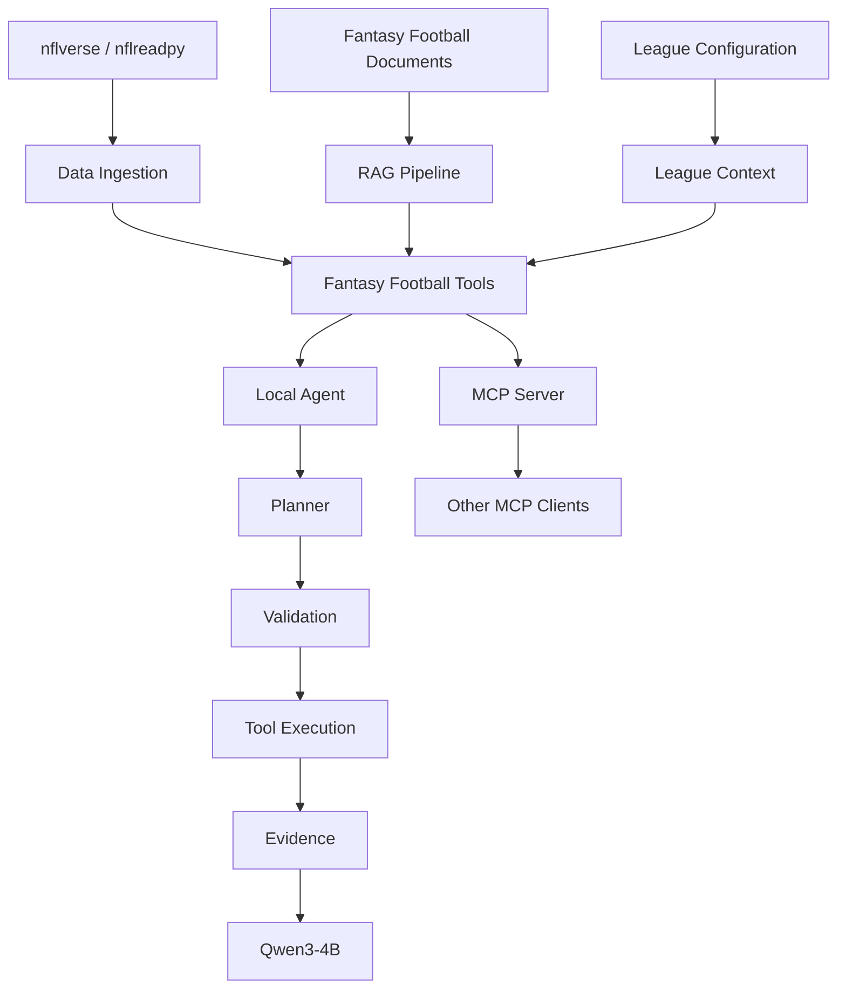

# Fantasy Football Intelligence

I'm building this project as a fantasy football data platform that can be used by both AI agents and other applications. It combines NFL data, league-specific information, RAG, a local LLM agent, and an MCP server.

The main idea is that the AI shouldn't *be* the platform. The football data and tools exist separately, and the local Qwen agent is just one way to use them. The MCP server exposes those same tools to other compatible AI clients.

This is still a work in progress. The core architecture is working, but I'm continuing to add data sources, tools, security features, and eventually my own player projection models.

## What's Working

### NFL Data

I'm currently using [nflverse](https://github.com/nflverse) through `nflreadpy` for NFL data.

So far I've added:

- weekly and season player stats
- recent-game stats
- depth chart data
- player resolution using GSIS player IDs
- local Parquet caching so the datasets don't need to be downloaded every run

The raw NFL datasets are kept locally and aren't committed to the repository.

### RAG

There's also a RAG pipeline for general fantasy football knowledge.

The current pipeline is:

```text
Question
   |
   v
Sentence Transformer Embedding
   |
   v
FAISS Search
   |
   v
Similarity / Coverage Filtering
   |
   v
Cross-Encoder Reranking
   |
   v
Relevant Context
```

It currently uses Sentence Transformers for embeddings, FAISS for vector search, and a cross-encoder to rerank the retrieved chunks.

The RAG corpus is pretty small right now. It's mainly there to get the retrieval architecture working before I spend more time building out the knowledge base.

### Local Agent

The reference agent currently runs Qwen3-4B locally.

I originally ran the model in BF16, but that nearly filled the 8 GB of VRAM on my laptop GPU and made inference extremely slow. I switched it to 4-bit NF4 quantization with `bitsandbytes`, which cut VRAM usage significantly and made the agent much faster.

The agent doesn't directly decide what code it can execute. Questions go through a few stages:

```text
Question
   |
   v
Planner
   |
   v
Policy + Validation
   |
   v
Tool Execution
   |
   v
Evidence Builder
   |
   v
Qwen
   |
   v
Answer
```

The planner decides which tools would help answer the question. That plan is then checked before anything gets executed.

### MCP Server

I added an MCP server so the platform isn't tied to my local Qwen agent.

The MCP server currently exposes four tools:

| Tool | What it does |
| --- | --- |
| `get_player_stats` | Gets season, weekly, or recent-game stats for a player |
| `get_player_depth_chart` | Gets the latest available depth chart information for a player |
| `search_fantasy_knowledge` | Searches the RAG knowledge base |
| `get_my_league_context` | Gets scoring and roster settings for the configured league |

An MCP client can discover the available tools and their schemas and call them without going through the built-in agent.

The same underlying Python tools are shared between both paths:

```text
                    tools/
                   /      \
                  v        v
          Local Agent    MCP Server
              |              |
              v              v
            Qwen       Other MCP Clients
```

That separation also means I can experiment with different models later without rewriting the football data/tool layer.

## Architecture



The important part here is that the data and tools aren't built around Qwen. Qwen is one client of the platform, while MCP provides another way to access the same functionality.

## Tool Safety

Since the planner is an LLM, I treat its output as untrusted input.

A generated plan goes through deterministic checks before tools are executed:

```text
LLM-generated plan
        |
        v
Required-tool policy
        |
        v
Tool allowlist
        |
        v
Argument validation
        |
        v
Controlled execution
```

The validator currently checks things like:

- whether the requested tool actually exists
- required and unexpected arguments
- argument types
- allowed ranges

For example, the model can't invent a new tool and have the executor run it, and it can't add arbitrary arguments such as a shell command to an existing tool.

There's still more I want to do here. Authentication/authorization around externally exposed tools, rate limiting, audit logging, prompt-injection defenses, and a more formal threat model are all things I plan to work on as the MCP side gets larger.

## Project Structure

```text
fantasyIntelligence/
|
+-- agent/
|   +-- evidence.py
|   +-- executor.py
|   +-- planner.py
|   +-- validator.py
|
+-- ingestion/
|   +-- depth_charts.py
|   +-- players.py
|   +-- stats.py
|
+-- league/
|   +-- context.py
|   +-- loader.py
|
+-- llm/
|   +-- generator.py
|
+-- mcp_server/
|   +-- server.py
|
+-- rag/
|   +-- build_rag_index.py
|   +-- chunker.py
|   +-- coverage.py
|   +-- embeddings.py
|   +-- loader.py
|   +-- reranker.py
|   +-- retriever.py
|   +-- storage.py
|   +-- topics.py
|   +-- vector_store.py
|
+-- scripts/
|   +-- test_mcp.py
|
+-- tests/
|   +-- evaluate_rag.py
|   +-- rag_questions.json
|
+-- tools/
|   +-- league_tool.py
|   +-- player_depth_chart.py
|   +-- player_stats.py
|   +-- rag_tool.py
|
+-- data/
|   +-- league.json
|   +-- raw/                  # generated locally, not committed
|
+-- documents/                # RAG source documents
+-- rag_data/                 # generated locally, not committed
|
+-- main.py
+-- requirements.txt
+-- README.md
+-- .gitignore
```

## Setup

Clone the repo:

```bash
git clone <repository-url>
cd fantasyIntelligence
```

Create a virtual environment.

Windows:

```powershell
python -m venv .venv
.venv\Scripts\Activate.ps1
```

macOS/Linux:

```bash
python3 -m venv .venv
source .venv/bin/activate
```

Install the dependencies:

```bash
python -m pip install -r requirements.txt
```

The local agent uses PyTorch with CUDA and 4-bit `bitsandbytes` quantization. Depending on the system and GPU, PyTorch/CUDA may need to be installed separately with the appropriate build.

## Building the RAG Index

The generated FAISS index isn't stored in Git. It can be rebuilt from the files in `documents/`:

```bash
python -m rag.build_rag_index
```

This generates the local files under:

```text
rag_data/
```

## NFL Data

NFL data is loaded through `nflreadpy` and cached as Parquet files under:

```text
data/raw/
```

Those files aren't committed because they're generated datasets.

Right now the project uses player stats and depth charts. I'm planning to add more of the available data as I build out the platform.

## Running the Agent

Once the required data and RAG index are available:

```bash
python main.py
```

The program takes fantasy football questions from the terminal and runs them through the planner/tool pipeline before generating the final answer.

## Running the MCP Server

The MCP server can be started with:

```bash
python -m mcp_server.server
```

It currently communicates over stdio and is meant to be launched by an MCP client.

I also have a small client script for testing tool discovery and calls:

```bash
python -m scripts.test_mcp
```

It connects to the server, lists the available MCP tools and schemas, and makes test calls against each of the current tools.

## What's Next

The main things I'm working on next are:

- adding more NFL data, especially schedules, play-by-play, snap counts, matchup data, and a current injury source
- expanding the RAG knowledge base
- integrating Sleeper for actual league settings, rosters, transactions, and other league data
- adding more tools to the MCP server
- adding more security around the MCP/tool layer
- building a feature pipeline for player projections
- training and evaluating my own fantasy projection models

The projection system is the bigger long-term part of the project. I don't want to just pull projections from another fantasy site and feed them to the AI.

Instead, the goal is something closer to:

```text
Historical NFL Data
        +
Recent Usage / Performance
        +
Opponent / Personnel Matchups
        +
Game Environment
        |
        v
Feature Engineering
        |
        v
Prediction Models
        |
        v
Projected Football Stats / Events
        |
        v
League Scoring Rules
        |
        v
Fantasy Point Projection
```

That also lets the same underlying model work with different fantasy leagues. The model predicts football performance, while the scoring layer handles the league-specific fantasy points.

Eventually I also want opponent strength to account for actual personnel instead of blindly treating a defense as the same team from year to year. For example, major offseason changes to a secondary should affect early-season matchup expectations before enough current-season team data exists to catch up.